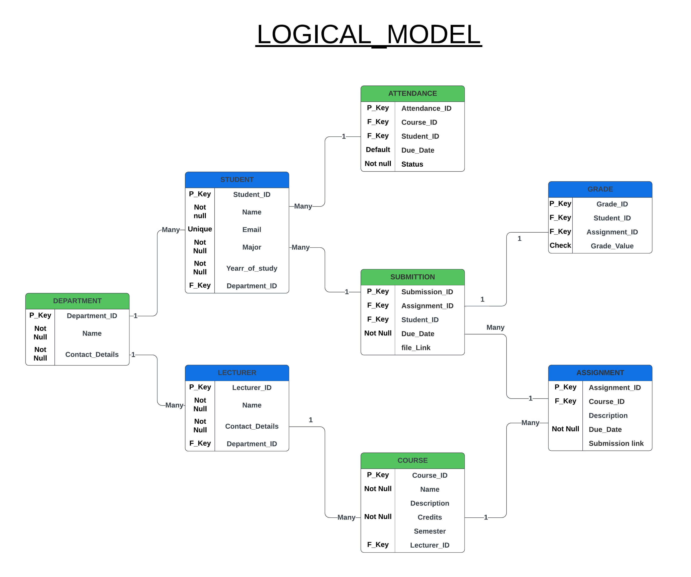

# _**Course_Management_System**_

## **CARDINALS GROUP MEMBERS**:

1.	  MUGISHA Julien			          26967
2.	  IRADUKUNDA Delphine 			    23665
3.	  SHEJA N M Yves				        26500
4.	  ISHIMWE Mireille 			        26828
5.	  INEZA HABAMENSHI Darryl		    25948
6.	  UWAYO Olga 				            26139
7.	  KAMALI MUSASIRA Philbert		  26261
8.	  IRAKOZE Arlaine Peace			    23753
9.	  ISHEMA NGABO Ange			        26035


## The provided documents in the main branch outline the design and objectives of a course management system aimed at streamlining tasks for university lecturers.
## Here are some insights of the whole progect:
<br>


## PHASE 2: 💼Business Process Modeling focuses on defining and visualizing the workflow of the course management system. This phase includes:
<br>

⚡ _**Scope**_ : Centralizing course management tasks like attendance, assignments, and grading.

😊 _**Objectives**_ : Automate attendance tracking, simplify grading, and offer real-time performance data.

😈 _**Entities**_ : Lecturer, Course, Class, Student, Assignment, Grade, and Department, each playing a specific role in the workflow.

😎 _**Significance in MIS**_ : The system supports decision-making by giving lecturers insights into student performance, enhancing efficiency in course administration​(refernce to Phase 2.docx ).
<br>
<br>
<br>


<br>
<br>


## PHASE 3: ⚙️Logical Model Design provides a structured database schema for the system. Key components include:
<br>
<br>


👌 _**Entities**_ : Department, Lecturer, Course, Student, Assignment, Submission, Grade, and Attendance.

😒 _**Relationships**_ : Defined using primary and foreign keys, the model connects students, lecturers, and courses to facilitate assignment submissions, grading, and attendance tracking.

😵 _**Goals**_ : Create an organized structure to support accurate and accessible data, enabling effective tracking of student progress and lecturer workload management​(reference to Phase 3.docx).




Together, these documents lay the foundation for a course management system that supports lecturers in administrative tasks and contributes to better educational outcomes.

# PHASE 4: 📡 _CREATING DATABASE AND ORACLE ENTERPRISE MANAGER._

## CREATION OF A PLUGGABLE DATABASE:

 We have to create a pluggable database for our project and we name it " _**TUE_CARDINALS_COURSEMANAGEMENTSYSTEM**_ ". We created it using the following codes

 ```sql

-- Step 1: Create the Pluggable Database (PDB)

CREATE PLUGGABLE DATABASE tue_cardinals_CourseManagementSystem
ADMIN USER tue_cardinals IDENTIFIED BY cardinals
ROLES = (DBA)
FILE_NAME_CONVERT = ('C:\app\CIOOL\product\21c\oradata\XE\pdbseed',
'C:\app\CIOOL\product\21c\oradata\XE\tue_cardinals_CourseManagementSystem/');

-- Step 2: Open the Pluggable Database

ALTER PLUGGABLE DATABASE tue_cardinals_CourseManagementSystem OPEN;

```
The result should be like this 

.PNG)

After this you should configure the Service Name through Net configuration assissant.

## ORACLE ENTERPRISE MANAGER:

Login with the username created and its password with the container as our pluggable database

It should give you, a homepage like this:

%20.PNG)

_For any futher information please go check on the Oracle enterprise tablespace screenshot and Oracle enterprise login screenshot._

# PHASE 5: 📝 _TABLE IMPLEMENTATION AND DATA INSERTION._

## TABLE CREATION:

Here are the codes for the creation of all tables while keeping data integrity and using corresponding constraints :

```sql
-- Table department
CREATE TABLE DEPARTMENT (
Department_ID INT PRIMARY KEY,
Name VARCHAR(100) NOT NULL,
Contact_Details VARCHAR(255) NOT NULL
);

-- Table lecturer
CREATE TABLE LECTURER (
Lecturer_ID INT PRIMARY KEY,
Name VARCHAR(100) NOT NULL,
Contact_Details VARCHAR(255) NOT NULL,
Department_ID INT NOT NULL,
FOREIGN KEY (Department_ID) REFERENCES DEPARTMENT(Department_ID)
);

-- Table course
CREATE TABLE COURSE (
Course_ID INT PRIMARY KEY,
Name VARCHAR(100) NOT NULL,
Description VARCHAR(200),
Credits INT NOT NULL,
Semester INT,
Lecturer_ID INT NOT NULL,
FOREIGN KEY (Lecturer_ID) REFERENCES LECTURER(Lecturer_ID)
);

-- Table student
CREATE TABLE STUDENT (
Student_ID INT PRIMARY KEY,
Name VARCHAR(100) NOT NULL,
Email VARCHAR(100) UNIQUE,
Major VARCHAR(100) NOT NULL,
Year_of_study INT NOT NULL,
Department_ID INT NOT NULL,
FOREIGN KEY (Department_ID) REFERENCES DEPARTMENT(Department_ID)
);

-- Table assignment
CREATE TABLE ASSIGNMENT (
Assignment_ID INT PRIMARY KEY,
Course_ID INT NOT NULL,
Description VARCHAR(200),
Due_Date DATE NOT NULL,
Submission_Link VARCHAR(255),
FOREIGN KEY (Course_ID) REFERENCES COURSE(Course_ID)
);

-- Table grade
CREATE TABLE GRADE (
GRADE_ID INT PRIMARY KEY,
Student_ID INT NOTNULL,
Assignment_ID INT NOT NULL,
Grade_Value INT NOT NULL,
FOREIGN KEY (Student_ID) REFERENCES STUDENT(Student_ID),
FOREIGN KEY (Assignment_ID) REFERENCES ASSIGNMENT(Assignment_ID)
);

-- Table submission
CREATE TABLE SUBMISSION (
Submission_ID INT PRIMARY KEY,
Assignment_ID INT NOT NULL,
Student_ID INT NOT NULL,
Submission_Date DATE NOT NULL,
File_Link VARCHAR(255),
FOREIGN KEY (Assignment_ID) REFERENCES ASSIGNMENT(Assignment_ID),
FOREIGN KEY (Student_ID) REFERENCES STUDENT(Student_ID)
);

-- Table attendance
CREATE TABLE ATTENDANCE (
Attendance_ID INT PRIMARY KEY,
Course_ID INT NOT NULL,
Student_ID INT NOT NULL,
Status VARCHAR(20) NOT NULL,
Attendance_Date DATE DEFAULT CURRENT_DATE,
FOREIGN KEY (Course_ID) REFERENCES COURSE(Course_ID),
FOREIGN KEY (Student_ID) REFERENCES STUDENT(Student_ID)
);

```
Here are some few sample of the Tables created for futher information, I recommend you to check out  ("Table_name" Table Screenshot) 

please do keep in mind to change the 'table_name' to your desired table.

.PNG)

## DATA INSERTION:

For the purpose of keeping the readme short, we chose to use few example to demostrate the insertion of data in our Tables. 

### 1. insertion for Department Table
.jpeg)

### 2. insertion for Course Table
.jpeg)

_**REMARK**_ : _PLEASE CHECK THE REST OF SCREENSHOT AT YOUR CONVINIENT TIME_

